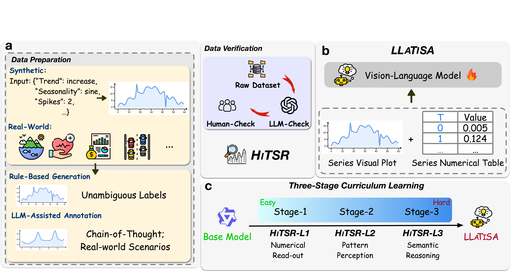

# LLaTiSA

[](https://huggingface.co/datasets/November-Rain/HiTSR)
[](https://arxiv.org/abs/2604.17295)


This is the official repository of the ACL 2026 Findings paper: "LLaTiSA: Towards Difficulty-Stratified Time Series Reasoning from Visual Perception to Semantics".

## Overview

<p align="center">

</p>


## Key Contributions

1. **Difficulty-Stratifed Dataset**: A comprehensive multimodal time series understanding dataset with three levels of complexity;
2. **Multi-modal Reasoning**: Combines visual perception (plots, numeric grids) with natural language instructions for advanced time series reasoning;
3. **Comprehensive Evaluation**: Benchmarks across multiple reasoning tasks and different time series encoding strategies.

<p align="center">

</p>

## Dataset

- **Hugging Face**: [HiTSR Dataset]
- **Statistics**:
  - Level 1 (Basic): 54,000 training samples
  - Level 2 (Intermediate): 45,632 training samples  
  - Level 3 (Advanced): 3,515 training samples


## Citation

```bibtex
@article{llatisa2026,
  title={LLaTiSA: Towards Difficulty-Stratified Time Series Reasoning from Visual Perception to Semantics},
  author={Yueyang Ding, HaoPeng Zhang, Rui Dai, Yi Wang, Tianyu Zong, Kaikui Liu, Xiangxiang Chu},
  journal={arxiv preprint arxiv: 2604.17295},
  year={2026}
}
